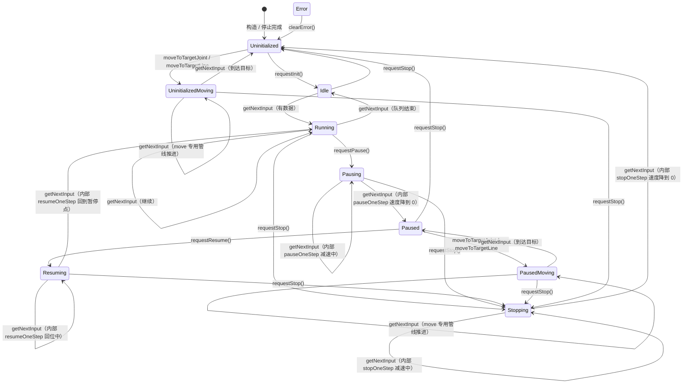

# PlannerState 状态机

`MultimodelPlanner` 的运行状态及迁移关系（见 `include/aris/plan/multimodel_async_planner.hpp` 中的 `enum class PlannerState`）。



## 状态含义

| 状态 | 含义 |
| --- | --- |
| `Uninitialized` | 未初始化（构造后、或停止后） |
| `Idle` | 已初始化且停止 |
| `Running` | 正常运行中 |
| `Stopping` | 正在减速停止，停止完成后进入 `Uninitialized` |
| `Pausing` | 正在减速暂停，降到 0 后进入 `Paused` |
| `Paused` | 已完全暂停，机器人可能被移动到其他位置 |
| `Resuming` | 正在恢复运行，先平滑运动回暂停位置 |
| `PausedMoving` | 正在移动到目标（独立管线），完成后回到 `Paused` |
| `UninitializedMoving` | 正在移动到目标（独立管线），完成后回到 `Uninitialized` |
| `Error` | 运行中出现错误 |

> 移动到目标（`moveToTargetJoint` / `moveToTargetLine`）使用独立管线（专用 tg/is/sr，单指令，zone=0），
> 不插入主队列。仅允许从 `Uninitialized`（→`UninitializedMoving`）或 `Paused`（→`PausedMoving`）启动；
> 已在 moving 状态时不能重复插入。

## 说明

- **稳定态**：`Idle`、`Paused`、`Uninitialized` 是三个“停住”的状态；`Stopping` / `Pausing` / `Resuming` / `PausedMoving` / `UninitializedMoving` 是过程态，每个 RT 周期推进一步，完成后跳到各自终态。
- **`PausedMoving` / `UninitializedMoving`**：move-to-target 的专用管线状态，完成后分别回到 `Paused` / `Uninitialized`。
- **`requestStop`**：可从除 `Uninitialized` 外的任意状态发起；已在 `Stopping` 时相当于空操作。
- **`requestPause`**：`Running → Pausing`（`Resuming → Pausing` 也支持，恢复中暂停）。
- **`requestResume`**：仅 `Paused → Resuming`，并在此时从 `resume_from_pos_` 到 `pause_pos_` 构建回位 scurve。
- **`Error`**：枚举中预留，当前代码尚未接入实际的进入/清除路径。

## 状态切换函数

所有状态写操作统一通过 `MultimodelPlanner::Imp::stateChange(PlannerState target)`，其内部的转移表即为上图依据：

```text
→ Uninitialized   : 任意状态（复位）
→ Idle            : Uninitialized / Idle / Running / MovingToTarget
→ Running         : Idle / Running / Resuming
→ Stopping        : 非 Uninitialized
→ Pausing         : Running / Pausing
→ Paused          : Pausing / MovingToTarget
→ Resuming        : Paused
→ MovingToTarget  : Uninitialized / Idle / Paused
```
